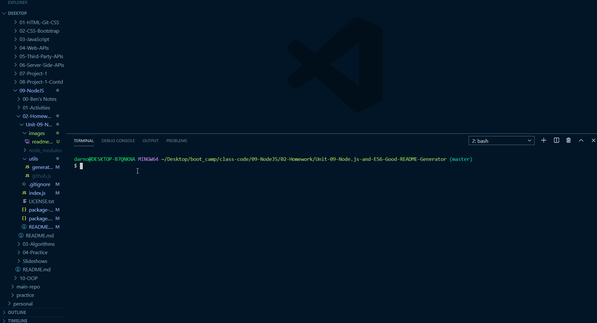

# README Generator

 

## Description

This is a command line application to generate READMEs for projects quickly and easily.
This generator provides the structure and formatting; all you have to provide is the content

## Table of Contents

- [Installation](#installation)
- [Usage](#usage)
- [Future Enhancements](#future-enhancements)
- [Credits](#credits)
- [Tests](#tests)
- [Questions](#questions)

## Installation

```
Fork repo, clone to machine
npm i to install packages
node index.js to run
Copy "README_.md" file and paste into repo
Rename file to "README.md"
```

## Usage

- After installation, follow the command line prompts to fill out information needed to automatically generate a README file for your project:



### Features

- **Credits** - Enter a comma-delimited list of credits. Support to automatically generate links is available for the following libraries/modules: inquirer, bootstrap, jest, font awesome, moments.js, express, chalk, fs, mysql

## Future Enhancements

- Support for more auto-linking of credits
- save file to specified directory
- only validate some input and not others
- restructure inquirer prompt / constructor function for more flexibility
- Tests
- Add support for bulleted or ordered lists for certain sections
- Add ability to add screenshots/demos
- pull name, email, and photo from github

## Credits

- [Inquirer](https://www.npmjs.com/package/inquirer)
- [write-to-file](https://www.npmjs.com/package/write-to-file)
- [Badges](https://shields.io/)

## Tests

Coming Soon

## Questions?

Contact me at [darian.nocera26@gmail.com](mailto:darian.nocera26@gmail.com)

or [](http://www.github.com/darnocer)

---

##### _Created with [darnocer's README generator](https://github.com/darnocer/Node.js-and-ES6-README-Generator)_ 👽
